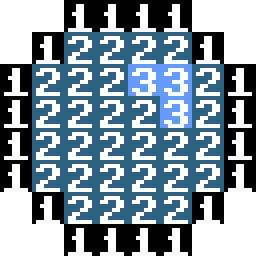

I needed a tool for condensing sprite data for a personal project. This tool is incredibly jank and inflexible, but frankly I just needed to get something working.

#What it does

The tool takes an image and organizes it into a list of 8x8 tiles and condensed down to 2 bits per pixel. This means each tile is 16 bytes, and the complete .bin file is only 4 kilobytes.

Case in point, let's take a simple ball sprite. The color indices would look something like this:

Under normal circumstances, the image is going to be stored as either a 24-bit RGB or 8-bit indexed image. For an uncompressed bitmap, the graphics for that ball would be around 64-192 bytes. In any other circumstance I'd be fine with this, but the project I'm currently working on has a 100kb upper limit for the total executable size, meaning normal image formats wouldn't work for me. Even a 128x128 PNG file would take up 16% of that limit.

Since I'm only using 4-color graphics for the game, we're instead crunching the data for 4 pixels into a single byte using some bitwise magic, reducing the file size for that ball sprite to a mere 16 bytes, and the overall spritesheet is now only 4kb.
